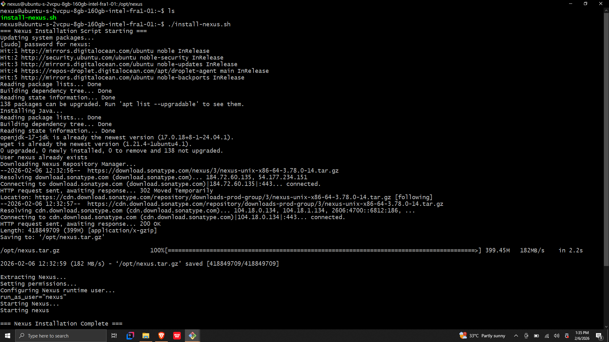
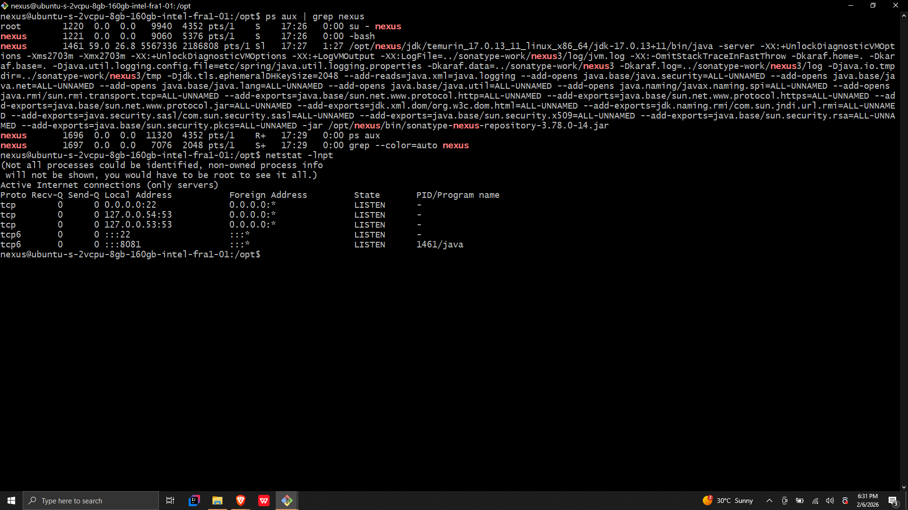
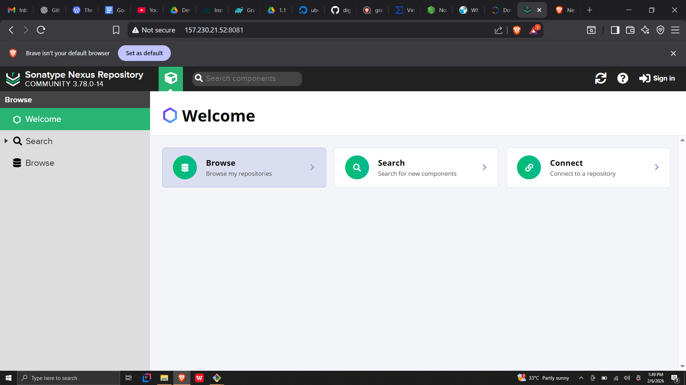
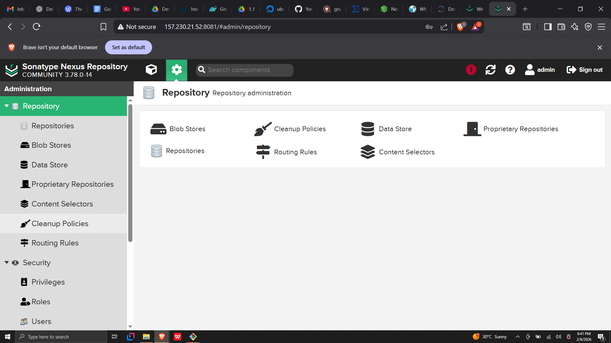
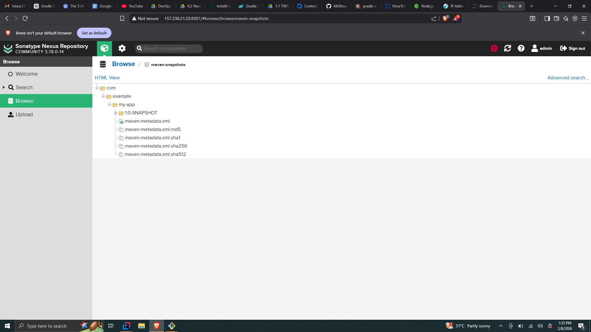
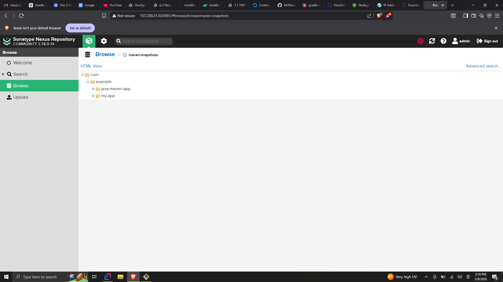

# Nexus Artifact Deployment 

## 📌 Overview

This project demonstrates a complete DevOps workflow for deploying and managing a **Nexus Repository Manager** on a cloud server and publishing Java artifacts using both **Gradle** and **Maven**.

The goal is to simulate a real-world artifact management pipeline:

- Provision a Linux server
- Install and configure Nexus Repository Manager
- Automate setup using shell scripts
- Build Java applications
- Publish artifacts to Nexus repositories
- Follow secure credential practices

---

## 🧱 Architecture Summary
```
Java App (Gradle/Maven)
        ↓
Publish artifacts
        ↓
Nexus Repository Manager
        ↓
Artifact storage & versioning
```

## 📁 Project Structure
```
nexus-artifact-deployment/
│
├── scripts/                  
│   ├── install-nexus.sh      
│   ├── publish-gradle.sh    
│   └── publish-maven.sh    
│
├── java-app/              
│   ├── build.gradle
│   ├── gradle.properties 
│   ├── settings.gradle
│   └── src/
│
├── java-maven-app/       
│   ├── pom.xml
│   └── src/
│
├── screenshots/         
│
└── README.md           
```
## 🚀 Phase 1 — Nexus Installation & Configuration

### Objective

Deploy Nexus Repository Manager from scratch on a Linux server using automation.

### Environment

- Cloud provider: DigitalOcean
- OS: Ubuntu Linux
- Java: OpenJDK 8
- Nexus Repository Manager 3

### Automated Installation Script

**Location:** scripts/install-nexus.sh

This script performs:

- System updates
- Java installation
- Nexus download & extraction
- User creation (`nexus`)
- Permission setup
- Nexus startup configuration

### Run Installation

```bash
chmod +x install-nexus.sh
./install-nexus.sh

```
### Nexus Installation


### Nexus Running


**Access Nexus UI:** http://SERVER-IP:8081

### Nexus UI Login


### Nexus Dashboard


## 📦 Phase 2 — Artifact Publishing Workflow

This phase demonstrates publishing Java artifacts into Nexus using:

- Gradle
- Maven

### 🔹 Gradle Artifact Publishing

**Project Location:** `java-app/`

### Build Configuration

build.gradle is configured to:
- Build a Java artifact
- Publish to Nexus Maven repository
Credentials are stored locally in:
`gradle.properties (not committed)`

### Build & Publish
```
./gradlew build
./gradlew publish
```
Or via automation:
```
./scripts/publish-gradle.sh
```
### 📸 Screenshot — Gradle Artifact in Nexus



### 🔹 Maven Artifact Publishing

**Project Location:** java-maven-app/

### Maven Configuration

Deployment settings are defined in `pom.xml`

Credentials stored securely in:
`~/.m2/settings.xml (not committed)`

### Build & Deploy

```
mvn clean package
mvn deploy
```
Or via automation:
```
./scripts/publish-maven.sh
```
### 📸 Screenshot — Maven Artifact in Nexus



### 🗂 Nexus Repository Usage

Default repositories used:

| Repository            | Purpose                            |
| --------------------- | ---------------------------------- |
| maven-public          | Group repository combining sources |
| maven-releases        | Stores release artifacts           |
| maven-snapshots       | Stores development builds          |
| maven-central (proxy) | External dependency caching        |


## Notes / Best Practices

- Credentials should never be pushed to GitHub(`gradle.properties` , `.m2/settings.xml`).
- Use `.gitignore` to exclude build artifacts and sensitive files.
- Folder structure separates scripts and projects for clarity.
- **Nexus repositories used:** Maven Snapshots, Maven Public (proxy)


## 🧠 Skills Demonstrated

- Linux server provisioning
- Shell scripting automation
- Nexus repository management
- Artifact publishing pipelines
- Gradle & Maven build workflows
- Secure credential handling
- DevOps documentation practices

## 🎯 Real-World Relevance

This setup mirrors enterprise environments where teams:
- Centralize artifact storage
- Control versioned releases
- Automate build publishing
- Improve dependency reliability

## ✅ Outcome
```
✔ Nexus deployed and running
✔ Automated installation pipeline
✔ Gradle artifact successfully published
✔ Maven artifact successfully deployed
✔ Secure configuration practices followed
```
## 📌 Future Improvements

- CI/CD integration
- Dockerized Nexus deployment
- Automated artifact versioning
- Nexus backup strategy
- Reverse proxy configuration

## Author
**ONYEKAOZURU TOCHUKWU DAVID**  
DevOps Engineer